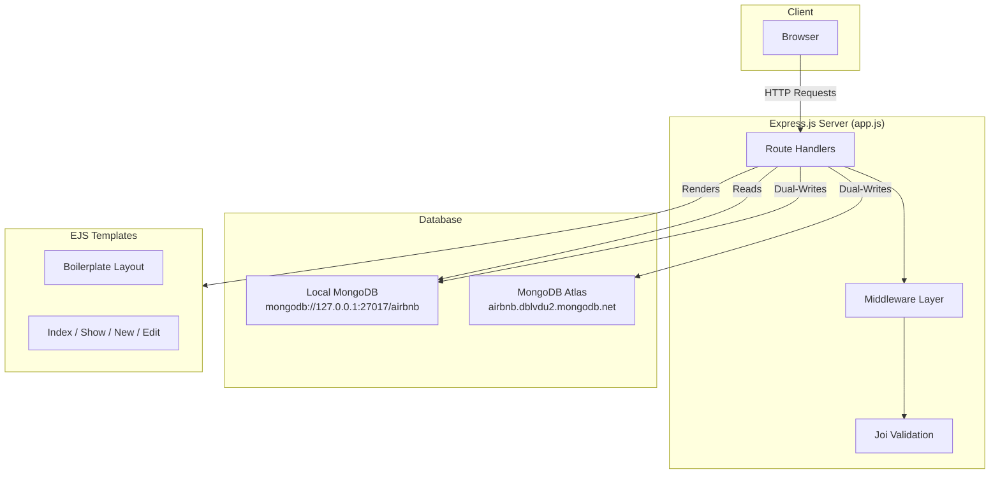
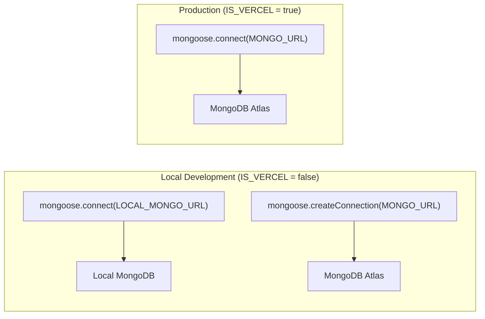
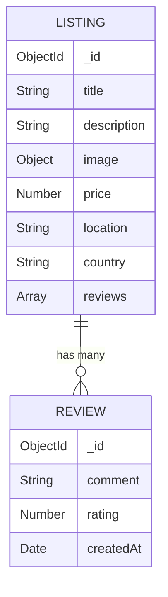

# FlexRent — Backend Developer Documentation

This document explains the core backend architecture, routing, middleware configuration, schemas, utilities, template rendering, and database patterns used in the FlexRent (Airbnb Clone) application.

---

## 1. Core Architecture & System Flow

FlexRent is a monolithic Model-View-Controller (MVC) application. It uses **Express** as the server framework, **MongoDB (Mongoose)** for persistence, and **EJS** for template rendering.

### Request-Response Life Cycle (Architecture Flow)



### Request Flow Description:
1. Browser sends an HTTP request (e.g., `POST /listings`).
2. Express parsing middlewares process request body and override query parameters.
3. Joi validation schema runs (`validatelisting`) to audit inputs.
4. The router calls async controller functions.
5. In local mode, database operations execute on both Local MongoDB and MongoDB Atlas (dual-write).
6. The engine renders the matched EJS templates and returns HTML to the client browser.

---

## 2. Express & EJS Integration

The application sets up EJS with layout templates (`ejs-mate`) and configures parsing middlewares:

```javascript
app.set("view engine", "ejs");
app.set("views", path.join(__dirname, "views"));
app.use(express.static(path.join(__dirname, "public")));
app.use(express.urlencoded({ extended: true }));
app.use(methodOverride("_method"));
app.engine("ejs", ejsMate);
```

### Explanations:
*   **`ejs-mate`**: Enables layout structures. By putting `<% layout("/layouts/boilerplate") %>` at the top of a template, EJS renders that page's content inside the boilerplate layout’s `<%- body %>` block.
*   **`urlencoded({ extended: true })`**: Parses incoming request bodies from HTML forms (e.g. `listing[title]`) into nested JavaScript objects (`req.body.listing`).
*   **`method-override`**: HTML forms natively only support `GET` and `POST`. We import `method-override` to map forms using actions like `/listings/id?_method=PUT` or `/listings/id?_method=DELETE` to Express `app.put` and `app.delete` routes.

---

## 3. Database Connection Configuration (MongoDB/Mongoose)

To handle both local development and live production cleanly without breaking Vercel Serverless runs, a **dual-database setup** is active:



### Connection Code Logic
```javascript
const IS_VERCEL = !!process.env.VERCEL || process.env.NODE_ENV === "production";

let AtlasListing, AtlasReview;

if (IS_VERCEL) {
    // Production connects only to Atlas directly
    mongoose.connect(MONGO_URL);
    AtlasListing = Listing;
    AtlasReview = Review;
} else {
    // Local connects to Local MongoDB primarily
    mongoose.connect(LOCAL_MONGO_URL);

    // Creates secondary connection explicitly pointing to Atlas cluster
    const atlasConnection = mongoose.createConnection(MONGO_URL);
    
    // Builds separate Atlas models referencing the same Mongoose Schema definitions
    AtlasListing = atlasConnection.model("Listing", Listing.schema);
    AtlasReview = atlasConnection.model("Review", Review.schema);
}
```

---

## 4. Database & Validation Schemas

Data validation happens at two distinct layers:
1.  **Joi Schemas** (Server-side incoming request validations).
2.  **Mongoose Schemas** (Database structure and type safety).

### Entity Relationship Model



### A. Mongoose Schemas & Middleware

*   **Listing Schema** ([model/listing.js](file:///Users/utkarshpatrikar/Code%20Files/AirBnB%20clone/model/listing.js)):
    Stores core fields and an array of ObjectIds referencing reviews:
    ```javascript
    reviews: [
        {
            type: Schema.Types.ObjectId,
            ref: "Review"
        }
    ]
    ```

*   **Cascade Delete Middleware**:
    If a listing is deleted locally using `findByIdAndDelete()`, it triggers the Mongoose hook `post("findOneAndDelete")` to delete associated reviews automatically:
    ```javascript
    listingSchema.post("findOneAndDelete", async (listing) => {
        if (listing) {
            await Review.deleteMany({ _id: { $in: listing.reviews } });
        }
    });
    ```

*   **Review Schema** ([model/review.js](file:///Users/utkarshpatrikar/Code%20Files/AirBnB%20clone/model/review.js)):
    Tracks comment text, rating bounds, and creation timestamp.

---

### B. Joi Validation Schemas

Server-side validation is defined in [schema.js](file:///Users/utkarshpatrikar/Code%20Files/AirBnB%20clone/schema.js). This ensures invalid requests (like missing a location or submitting empty comments) are rejected before reaching Mongoose.

```javascript
module.exports.listingSchema = Joi.object({
    listing: Joi.object({
        title: Joi.string().required(),
        description: Joi.string().required(),
        price: Joi.number().required(),
        image: Joi.string().allow("", null),
        location: Joi.string().required(),
        country: Joi.string().required(),
    }).required()
});

module.exports.reviewSchema = Joi.object({
    review: Joi.object({
        rating: Joi.number().required().min(1).max(5),
        comment: Joi.string().required()
    }).required()
});
```

---

## 5. Middlewares Configuration

Express middlewares execute in a chain. Custom middle-tier validations intercept requests:

### Route-Level Validation Middlewares
```javascript
const validatelisting = (req, res, next) => {
    let { error } = listingSchema.validate(req.body);
    if (error) {
        throw new ExpressError(error.details[0].message, 400);
    } else {
        next();
    }
};

const validatereview = (req, res, next) => {
    let { error } = reviewSchema.validate(req.body);
    if (error) {
        throw new ExpressError(error.details[0].message, 400);
    } else {
        next();
    }
};
```
If the schema validation fails, it throws a custom `ExpressError`. Otherwise, `next()` tells Express to pass control to the route controller.

### Global Error Handling Middleware
Placed at the end of the middleware stack in `app.js`:
```javascript
// 404 Route Catch-All
app.all("/*any", (req, res, next) => {
    next(new ExpressError("Page not found", 404));
});

// Final Error Handling Middleware
app.use((err, req, res, next) => {
    let { statusCode = 500, message = "something went wrong" } = err;
    res.status(statusCode).render("error", { err: { statusCode, message, stack: err.stack } });
});
```

---

## 6. API Route Implementations & Database Dual-Writes

### A. Listings Routing

*   **Create Listing** (`POST /listings`):
    Generates a synchronized unique `ObjectId` first, saving it to both instances:
    ```javascript
    const listingId = new mongoose.Types.ObjectId();
    const newListing = new Listing({ _id: listingId, ...rest });
    await newListing.save();

    if (!IS_VERCEL) {
        const newAtlasListing = new AtlasListing({ _id: listingId, ...rest });
        await newAtlasListing.save();
    }
    ```

*   **Update Listing** (`PUT /listings/:id`):
    Updates properties. If local, it updates both targets:
    ```javascript
    await Listing.findByIdAndUpdate(id, updateData);
    if (!IS_VERCEL) {
        await AtlasListing.findByIdAndUpdate(id, updateData);
    }
    ```

*   **Delete Listing** (`DELETE /listings/:id`):
    Cleans up reviews on both databases, then removes the listing:
    ```javascript
    await Listing.findByIdAndDelete(id); // Hooks automatically clean up local reviews

    if (!IS_VERCEL) {
        let atlasListing = await AtlasListing.findById(id);
        if (atlasListing) {
            await AtlasReview.deleteMany({ _id: { $in: atlasListing.reviews } });
        }
        await AtlasListing.findByIdAndDelete(id);
    }
    ```

---

### B. Reviews Routing

*   **Submit Review** (`POST /listings/:id/reviews`):
    Creates a new review document with a shared `ObjectId` and pushes it into the listing's `reviews` reference array:
    ```javascript
    let listing = await Listing.findById(req.params.id);
    const reviewId = new mongoose.Types.ObjectId();
    let newReview = new Review({ _id: reviewId, ...req.body.review });

    listing.reviews.push(newReview);
    await newReview.save();
    await listing.save();

    if (!IS_VERCEL) {
        let atlasListing = await AtlasListing.findById(req.params.id);
        let newAtlasReview = new AtlasReview({ _id: reviewId, ...req.body.review });
        atlasListing.reviews.push(newAtlasReview);
        await newAtlasReview.save();
        await atlasListing.save();
    }
    ```

*   **Delete Review** (`DELETE /listings/:id/reviews/:reviewId`):
    Removes the ID reference from the listing's `reviews` array using `$pull` and deletes the review document:
    ```javascript
    await Listing.findByIdAndUpdate(id, { $pull: { reviews: reviewId } });
    await Review.findByIdAndDelete(reviewId);

    if (!IS_VERCEL) {
        await AtlasListing.findByIdAndUpdate(id, { $pull: { reviews: reviewId } });
        await AtlasReview.findByIdAndDelete(reviewId);
    }
    ```

---

## 7. Utils Configuration

### A. wrapAsync.js
In standard Express 4, unhandled promise rejections inside async functions crash the process or get swallowed. `wrapAsync` intercepts rejected promises and directs them to the Express error stack:
```javascript
function wrapAsync(fn) {
    return function(req, res, next) {
        fn(req, res, next).catch(next);
    };
}
module.exports = wrapAsync;
```

### B. ExpressError.js
Extends JavaScript's standard `Error` class so custom HTTP status codes (like `400` or `404`) can accompany descriptive error messages:
```javascript
class ExpressError extends Error {
    constructor(message, statusCode) {
        super(message);
        this.statusCode = statusCode;
    }
}
module.exports = ExpressError;
```
