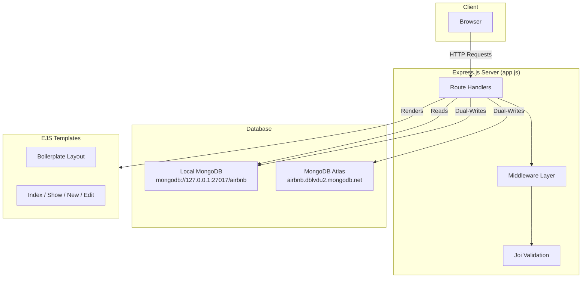
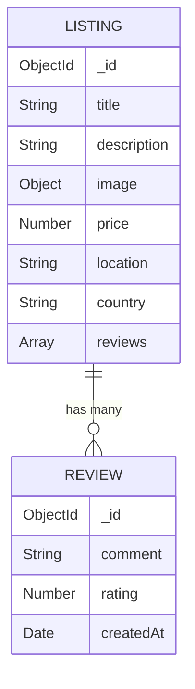
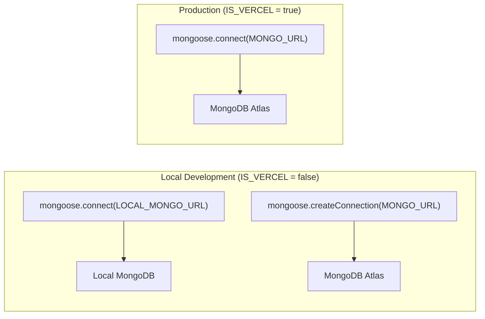

# FlexRent — Technical Documentation

> A full-stack rental listing platform built with Express.js, MongoDB, and EJS. Deployed on Vercel with dual-database synchronization between local MongoDB and MongoDB Atlas.

---

## Table of Contents

1. [Architecture Overview](#architecture-overview)
2. [Project Structure](#project-structure)
3. [Tech Stack](#tech-stack)
4. [Database Design](#database-design)
5. [Environment Configuration](#environment-configuration)
6. [Dual-Write Database Synchronization](#dual-write-database-synchronization)
7. [API Routes](#api-routes)
8. [Validation](#validation)
9. [Error Handling](#error-handling)
10. [Views & Templates](#views--templates)
11. [Deployment](#deployment)
12. [Getting Started](#getting-started)

---

## Architecture Overview



### Request Flow

1. Browser sends an HTTP request.
2. Express middleware parses the body and handles method overrides.
3. Route-specific Joi validation runs (for POST/PUT requests).
4. The route handler executes database operations via Mongoose.
5. In local development, write operations are performed on **both** local MongoDB and Atlas (dual-write).
6. In production (Vercel), only Atlas is used.
7. EJS templates are rendered and sent back to the client.

---

## Project Structure

```
AirBnB clone/
├── app.js                    # Main application entry point
├── schema.js                 # Joi validation schemas
├── vercel.json               # Vercel deployment configuration
├── nginx.conf                # Nginx reverse proxy template (gitignored)
├── package.json              # Dependencies and metadata
├── .env                      # Environment variables (gitignored)
├── .gitignore                # Git ignore rules
│
├── model/
│   ├── listing.js            # Listing Mongoose schema & model
│   └── review.js             # Review Mongoose schema & model
│
├── utils/
│   ├── ExpressError.js       # Custom error class with statusCode
│   └── wrapAsync.js          # Async error wrapper for route handlers
│
├── init/
│   ├── data.js               # Seed data (29 sample listings)
│   └── index.js              # Database seeder script
│
├── public/
│   └── css/
│       └── styles.css        # Global stylesheet
│
└── views/
    ├── home.ejs              # Landing page
    ├── error.ejs             # Error page template
    ├── layouts/
    │   └── boilerplate.ejs   # Base HTML layout (head, navbar, footer)
    ├── includes/
    │   ├── navbar.ejs        # Navigation bar partial
    │   └── footer.ejs        # Footer partial
    └── listings/
        ├── index.ejs         # All listings grid page
        ├── show.ejs          # Single listing detail page
        ├── new.ejs           # Create listing form
        └── edit.ejs          # Edit listing form
```

---

## Tech Stack

| Layer | Technology | Version |
|---|---|---|
| **Runtime** | Node.js | 20.x |
| **Framework** | Express.js | 5.2.1 |
| **Database** | MongoDB / Mongoose | 9.7.3 |
| **Templating** | EJS + ejs-mate | 6.0.1 / 4.0.0 |
| **Validation** | Joi | 18.2.3 |
| **Deployment** | Vercel (Serverless) | — |
| **Cloud DB** | MongoDB Atlas (AWS) | — |
| **Styling** | Bootstrap 5.3.8 + Font Awesome 7.0.1 | CDN |
| **Font** | Plus Jakarta Sans | Google Fonts |

---

## Database Design

### Listing Schema

Defined in [model/listing.js](file:///Users/utkarshpatrikar/Code%20Files/AirBnB%20clone/model/listing.js):

| Field | Type | Required | Default |
|---|---|---|---|
| `title` | String | ✅ | — |
| `description` | String | — | — |
| `image.filename` | String | — | `"listingimage"` |
| `image.url` | String | — | Unsplash placeholder |
| `price` | Number | — | — |
| `location` | String | — | — |
| `country` | String | — | — |
| `reviews` | [ObjectId] → Review | — | `[]` |

**Middleware:** A `post("findOneAndDelete")` hook cascade-deletes all associated reviews when a listing is removed.

### Review Schema

Defined in [model/review.js](file:///Users/utkarshpatrikar/Code%20Files/AirBnB%20clone/model/review.js):

| Field | Type | Required | Constraints |
|---|---|---|---|
| `comment` | String | ✅ | — |
| `rating` | Number | — | min: 1, max: 5 |
| `createdAt` | Date | — | Default: `Date.now()` |

### Entity Relationship



---

## Environment Configuration

### `.env` File

```env
MONGO_URL="mongodb+srv://<user>:<pass>@<cluster>.mongodb.net/airbnb?retryWrites=true&w=majority"
LOCAL_MONGO_URL="mongodb://127.0.0.1:27017/airbnb"
```

### Environment Detection

The app uses the `IS_VERCEL` flag to determine the runtime environment:

```javascript
const IS_VERCEL = !!process.env.VERCEL || process.env.NODE_ENV === "production";
```

| Variable | Local Dev | Vercel Production |
|---|---|---|
| `IS_VERCEL` | `false` | `true` |
| Primary DB | Local MongoDB | MongoDB Atlas |
| Secondary DB | MongoDB Atlas (sync) | None |
| `dotenv` loaded | ✅ | ❌ (env vars set via Vercel dashboard) |
| `app.listen()` | ✅ (port 8080) | ❌ (serverless, `module.exports = app`) |

---

## Dual-Write Database Synchronization

### How It Works

In **local development**, every write operation (create, update, delete) is executed against **both** the local MongoDB and MongoDB Atlas to keep them in sync.

In **production (Vercel)**, only Atlas is used — `AtlasListing` and `AtlasReview` are aliased to the primary `Listing` and `Review` models.

### Connection Setup



### Dual-Write Pattern

Every write route follows this pattern:

```javascript
// 1. Write to primary database (always)
await Listing.findByIdAndUpdate(id, updateData, { new: true });

// 2. Write to Atlas (only in local dev)
if (!IS_VERCEL) {
    await AtlasListing.findByIdAndUpdate(id, updateData);
}
```

### ID Consistency

New documents generate a shared `ObjectId` before saving to ensure both databases have identical `_id` values:

```javascript
const listingId = new mongoose.Types.ObjectId();
const newListing = new Listing({ _id: listingId, ...data });
const newAtlasListing = new AtlasListing({ _id: listingId, ...data });
```

### Cascade Delete Handling

| Environment | Listing Reviews Cleanup |
|---|---|
| **Local** | Schema middleware (`post findOneAndDelete`) auto-deletes local reviews. Atlas reviews are deleted explicitly in the route handler before `AtlasListing.findByIdAndDelete()`. |
| **Vercel** | Schema middleware handles it directly — `Review` points to Atlas. |

---

## API Routes

### Listings

| Method | Path | Handler | Middleware | Description |
|---|---|---|---|---|
| `GET` | `/` | Render home | — | Landing page |
| `GET` | `/listings` | Index | `wrapAsync` | Show all listings |
| `GET` | `/listings/new` | New form | — | Render create form |
| `POST` | `/listings` | Create | `validatelisting`, `wrapAsync` | Create listing + dual-write |
| `GET` | `/listings/:id` | Show | `wrapAsync` | Show listing with populated reviews |
| `GET` | `/listings/:id/edit` | Edit form | `wrapAsync` | Render edit form |
| `PUT` | `/listings/:id` | Update | `validatelisting`, `wrapAsync` | Update listing + dual-write |
| `DELETE` | `/listings/:id` | Delete | `wrapAsync` | Delete listing + reviews + dual-write |

### Reviews

| Method | Path | Handler | Middleware | Description |
|---|---|---|---|---|
| `POST` | `/listings/:id/reviews` | Create review | `validatereview`, `wrapAsync` | Add review to listing + dual-write |
| `DELETE` | `/listings/:id/reviews/:reviewId` | Delete review | `wrapAsync` | Remove review from listing array + delete review document + dual-write |

---

## Validation

Server-side validation is implemented using **Joi** in [schema.js](file:///Users/utkarshpatrikar/Code%20Files/AirBnB%20clone/schema.js).

### Listing Validation

```javascript
listingSchema = Joi.object({
    listing: Joi.object({
        title: Joi.string().required(),
        description: Joi.string().required(),
        price: Joi.number().required(),
        image: Joi.string().allow("", null),
        location: Joi.string().required(),
        country: Joi.string().required(),
    }).required()
})
```

### Review Validation

```javascript
reviewSchema = Joi.object({
    review: Joi.object({
        rating: Joi.number().required().min(1).max(5),
        comment: Joi.string().required()
    }).required()
})
```

> [!NOTE]
> Schemas are wrapped in a `listing` / `review` parent object to match the nested form field format (`listing[title]`, `review[comment]`), which Express's `urlencoded` parser converts to `req.body.listing` and `req.body.review`.

---

## Error Handling

### Custom Error Class

[utils/ExpressError.js](file:///Users/utkarshpatrikar/Code%20Files/AirBnB%20clone/utils/ExpressError.js) extends `Error` with a `statusCode` property:

```javascript
class ExpressError extends Error {
    constructor(message, statusCode) {
        super(message);
        this.statusCode = statusCode;
    }
}
```

### Async Wrapper

[utils/wrapAsync.js](file:///Users/utkarshpatrikar/Code%20Files/AirBnB%20clone/utils/wrapAsync.js) catches rejected promises in async route handlers and forwards them to Express error middleware:

```javascript
function wrapAsync(fn) {
    return function(req, res, next) {
        fn(req, res, next).catch(next);
    }
}
```

### Error Middleware Chain

1. **404 Catch-All:** `app.all("/*any")` throws `ExpressError("Page not found", 404)`.
2. **Global Handler:** Renders `error.ejs` with the status code, message, and stack trace.

---

## Views & Templates

### Layout System

The app uses **ejs-mate** for layout inheritance. All pages extend [boilerplate.ejs](file:///Users/utkarshpatrikar/Code%20Files/AirBnB%20clone/views/layouts/boilerplate.ejs), which includes:

- **Head:** Meta tags, Bootstrap CSS, Font Awesome, Google Fonts, custom stylesheet
- **Navbar:** Brand logo, Home, All Listings, Add New Listing links
- **Content area:** `<%- body %>` placeholder
- **Footer:** Social links, copyright

### Page Templates

| Template | Purpose |
|---|---|
| [index.ejs](file:///Users/utkarshpatrikar/Code%20Files/AirBnB%20clone/views/listings/index.ejs) | Responsive card grid of all listings with images, prices, and overlays |
| [show.ejs](file:///Users/utkarshpatrikar/Code%20Files/AirBnB%20clone/views/listings/show.ejs) | Two-column detail page with hero image, description, sticky price card, star rating form, and review cards with avatar initials |
| [new.ejs](file:///Users/utkarshpatrikar/Code%20Files/AirBnB%20clone/views/listings/new.ejs) | Bootstrap form for creating a new listing |
| [edit.ejs](file:///Users/utkarshpatrikar/Code%20Files/AirBnB%20clone/views/listings/edit.ejs) | Pre-filled Bootstrap form for editing an existing listing |
| [error.ejs](file:///Users/utkarshpatrikar/Code%20Files/AirBnB%20clone/views/error.ejs) | Error display page with status code, message, and stack trace |

---

## Deployment

### Vercel Configuration

[vercel.json](file:///Users/utkarshpatrikar/Code%20Files/AirBnB%20clone/vercel.json) routes all traffic to the Express app:

```json
{
  "version": 2,
  "builds": [{ "src": "app.js", "use": "@vercel/node" }],
  "routes": [{ "src": "/(.*)", "dest": "app.js" }]
}
```

### Vercel Environment Variables

Set via the Vercel dashboard:

| Variable | Target |
|---|---|
| `MONGO_URL` | production, preview, development |

### Serverless Adaptation

- `app.listen()` is wrapped in `if (!process.env.VERCEL)` to prevent it from running in serverless.
- `module.exports = app` exports the Express instance for Vercel's `@vercel/node` builder.

### Nginx (Optional VPS)

An [nginx.conf](file:///Users/utkarshpatrikar/Code%20Files/AirBnB%20clone/nginx.conf) template is included (gitignored) for potential VPS deployment as a reverse proxy to `localhost:8080`.

---

## Getting Started

### Prerequisites

- Node.js 20+
- MongoDB (local instance running on port 27017)
- MongoDB Atlas cluster (for cloud sync)

### Installation

```bash
# Clone the repository
git clone <repo-url>
cd "AirBnB clone"

# Install dependencies
npm install

# Configure environment
cp .env.example .env
# Edit .env with your MongoDB Atlas connection string
```

### Seed the Database

```bash
node init/index.js
```

This populates the database with 29 sample listings.

### Run Locally

```bash
# With nodemon (recommended)
npx nodemon app.js

# Or directly
node app.js
```

The app runs at **http://localhost:8080**.

### Deploy to Vercel

```bash
# Install Vercel CLI
npm i -g vercel

# Deploy
vercel --prod
```

Ensure `MONGO_URL` is set in your Vercel project's environment variables.
